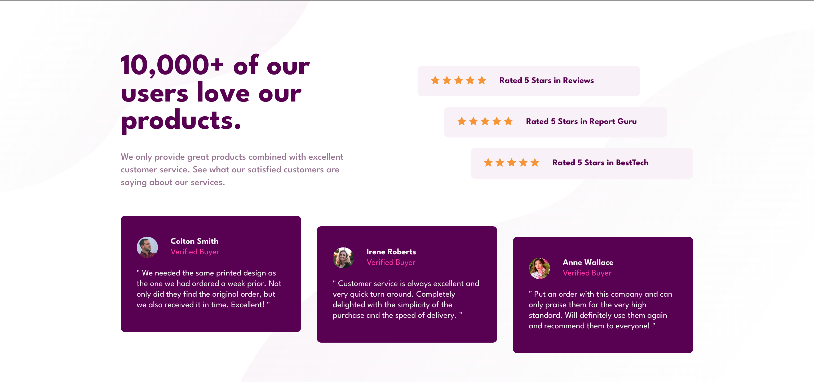

  <a href="#-tecnologias">Tecnologias</a>&nbsp;&nbsp;&nbsp;|&nbsp;&nbsp;&nbsp;
  <a href="#-projeto">Projeto</a>&nbsp;&nbsp;&nbsp;|&nbsp;&nbsp;&nbsp;
  <a href="#-layout">Layout</a>

 

 

  &nbsp;&nbsp;&nbsp;&nbsp;
  

## 🚀 Tecnologias

Esse projeto foi desenvolvido com as seguintes tecnologias:

- HTML
- CSS

Bibliotecas

- [Google Fonts](https://fonts.google.com/)

## 💻 Projeto

Desenvolvido pela Frontend Mentor. 
Um projeto perfeito para iniciantes que estão começando a ganhar confiança com layouts! 
O desafio é construir esta seção de prova social e fazê-la parecer o mais próximo possível do design.  
Versão Mobile e Versão Desktop.

➡️ &nbsp;&nbsp;[Acesso ao projeto](https://mariamorena27.github.io/social_proof_section/)

---

## 🔖 Layout

Você pode visualizar o layout do projeto através [desse link](https://www.frontendmentor.io/challenges/social-proof-section-6e0qTv_bA).

---

Feito com ♥ by Maria Morena!
